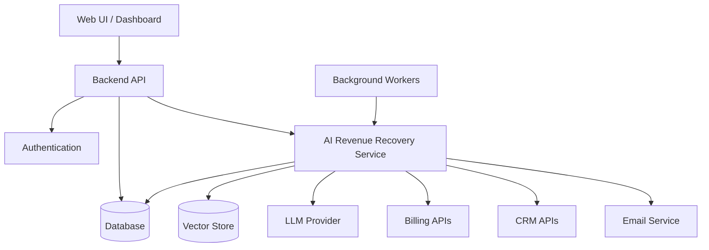
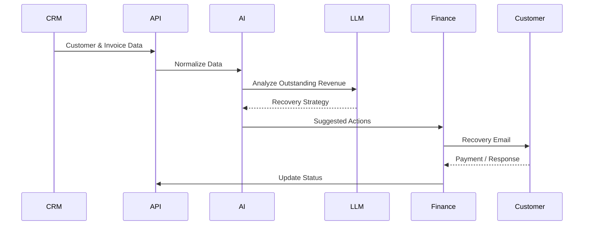

[repo]: https://github.com/mscbuild/AI-Revenue-Recovery/
[demo]: https://mscbuild.github.io/AI-Revenue-Recovery/

<div align="center">
 
# Revenue Recovery AI Agent

</div>

<div align="center">

[](https://python.org)
[](https://google.github.io/adk-docs)

[](https://github.com/jlowin/fastmcp)
[](https://streamlit.io)


 

## The AI Agent continuously monitors business data and alerts teams with recommended actions.

**[Browse Online](https://mscbuild.github.io/AI-Revenue-Recovery/)** · **[Documentation](#documentation)** · **[Contributing](#contributing)** · **[License](#license)**

</div>
 

## Business Problem

Companies lose revenue due to several recurring issues:

- **Leads are not followed up** – potential customers fall through the cracks.
- **Contracts are close to expiration** – missed renewal opportunities.
- **Customers show churn signals** – early warning signs are ignored.
- **Invoices remain unpaid** – cash flow is negatively impacted.
- **Sales opportunities become stalled** – deals linger without progress.

The **Revenue Recovery AI Agent** continuously monitors business data sources (CRM, billing, support tickets, usage logs, etc.) and proactively alerts relevant teams with concrete, data‑driven recommended actions.

---

## Features

- ✅ **Detect stalled sales deals** – flags deals that have not moved forward for a configurable period.
- ✅ **Predict customer churn risk** – uses ML models to score churn probability and surface at‑risk accounts.
- ✅ **Identify overdue invoices** – scans billing data and highlights unpaid invoices past due date.
- ✅ **Generate recommended actions** – suggests next steps (e.g., outreach, discount offers, renewal reminders).
- ✅ **Prioritize opportunities by revenue impact** – ranks alerts by estimated financial loss.
- ✅ **Natural‑language business dashboard** – summarises insights in plain English for quick consumption.

---

## Tech Stack

| Layer | Technology | Reason |
|-------|------------|--------|
| **Data Ingestion** | Python (pandas, SQLAlchemy) | Flexible data handling and DB connectivity |
| **Machine Learning** | scikit‑learn / XGBoost | Proven models for churn and risk prediction |
| **Alert Engine** | FastAPI | Lightweight, asynchronous HTTP API |
| **Message Delivery** | Slack / Microsoft Teams Webhooks | Real‑time team notifications |
| **Dashboard** | Streamlit (or Next.js) + Plotly | Interactive, NLP‑enabled UI |
| **Orchestration** | Apache Airflow (or Prefect) | Scheduling of daily/weekly monitoring jobs |
| **Persistence** | PostgreSQL + Redis | Reliable storage + fast caching |

---
## Project Structure

```
customer-support-agent/
├─ app/                 # FastAPI application code
│   └─ *.py
├─ dashboard/           # Next.js (or Streamlit) UI
│   ├─ app/
│   │   └─ page.tsx
│   └─ ... (generated by Next.js)
├─ tests/               # Unit and integration tests
│   └─ test_*.py
├─ Dockerfile           # Multi‑stage container build
├─ requirements.txt
├─ README.md
├─ agents-cli-manifest.yaml
└─ .env.example
```


## Installation

> **Prerequisites**
> - Python 3.10+ installed
> - PostgreSQL instance (local or remote)
> - Redis server (optional, for cache)
> - Access to your CRM/Billing APIs (e.g., Salesforce, Stripe)

```bash
# 1. Clone the repository
git clone https://github.com/mscbuild/AI-Revenue-Recovery-agent.git
cd AI-Revenue-Recovery

# 2. Create a virtual environment
python -m venv .venv
source .venv/Scripts/activate   # on Windows PowerShell
# .venv\Scripts\activate   # alternative for cmd

# 3. Install dependencies
pip install -r requirements.txt

# 4. Configure environment variables (copy the template)
cp .env.example .env
# Edit .env to add your DB connection strings, API keys, webhook URLs, etc.
```

---

## Launch & Operation

### 1. Initialise the Database
```bash
alembic upgrade head   # runs migrations
```

### 2. Start the Scheduler (Airflow example)
```bash
airflow webserver --port 8080   # UI for monitoring DAGs
airflow scheduler               # runs the monitoring jobs
```

### 3. Run the API Server
```bash
uvicorn app.main:app --host 0.0.0.0 --port 8000
```

### 4. Open the Dashboard
Navigate to `http://localhost:8501` (Streamlit) or `http://localhost:3000` (Next.js) to view the natural‑language summary of alerts and drill‑down into each recommendation.

---

## Project Diagram

Below is a high‑level architecture diagram (generated with Mermaid).  It visualises data flow from source systems through the AI engine to the alert delivery channels.



---


## Usage Examples

### Prompting the Agent via CLI
```bash
python -m agent suggest_action --entity customer_id=12345
```
> **Response**: "Customer 12345 shows a churn risk of 82 %. Recommended action: schedule a 15‑minute check‑in call within the next 2 days and offer a 10 % discount on renewal."

### Sample Slack Notification
```
🚨 *Revenue Alert – Stalled Deal*
Deal: ACME Corp – $150,000
Stage: Negotiation (no activity > 14 days)
Recommended Action: Assign senior sales rep to follow‑up and propose a limited‑time discount.
```

---

## Future Improvements

- **Real‑time streaming** – replace batch ETL with Kafka for sub‑second alerts.
- **LLM‑enhanced recommendations** – use GPT‑4 to draft personalized outreach emails.
- **Multi‑tenant SaaS version** – allow multiple businesses to run isolated instances.
- **A/B testing framework** – measure impact of recommended actions on revenue recovery.

---
## Security & Auditing

- **Workflow node `security_checkpoint`**: sanitizes incoming payloads before they enter the risk analysis workflow.
- **PII scrubbing**: detects and redacts email addresses, credit‑card numbers, SSNs, and phone numbers.
- **Prompt‑injection detection**: flags keywords such as “ignore previous instructions”, “disregard prior context”, and “override system prompt”.
- **Audit log**: each action writes a JSON line to `audit_log.jsonl` with severity levels **INFO**, **WARNING**, or **CRITICAL**.
- **Domain‑specific rule**: any list (`deals`, `crm`, `invoices`, `customers`, `transactions`) larger than 100 items is truncated, logged as **CRITICAL**, and processed safely.

---

## Contributing

Contributions are welcome! Please read the [CONTRIBUTING.md](CONTRIBUTING.md) for guidelines on how to submit pull requests, run tests, and follow the coding style.

---

## License

This project is licensed under the **MIT License** – see the [LICENSE](LICENSE) file for details.

<!--
keywords: ai workflows, agent automation, agent examples, agent templates, no-code automation, telegram bot workflows, openai agent, webhook automation, gemini, claudecode, promt, bussiness
-->
